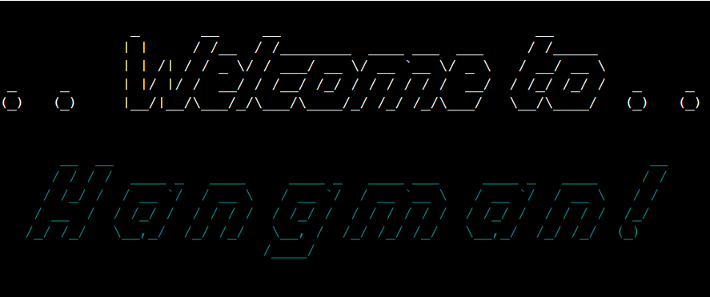
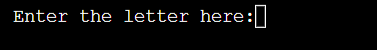
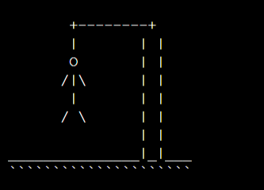
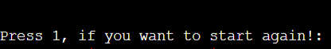
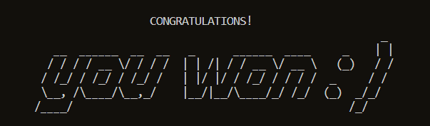
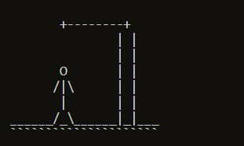
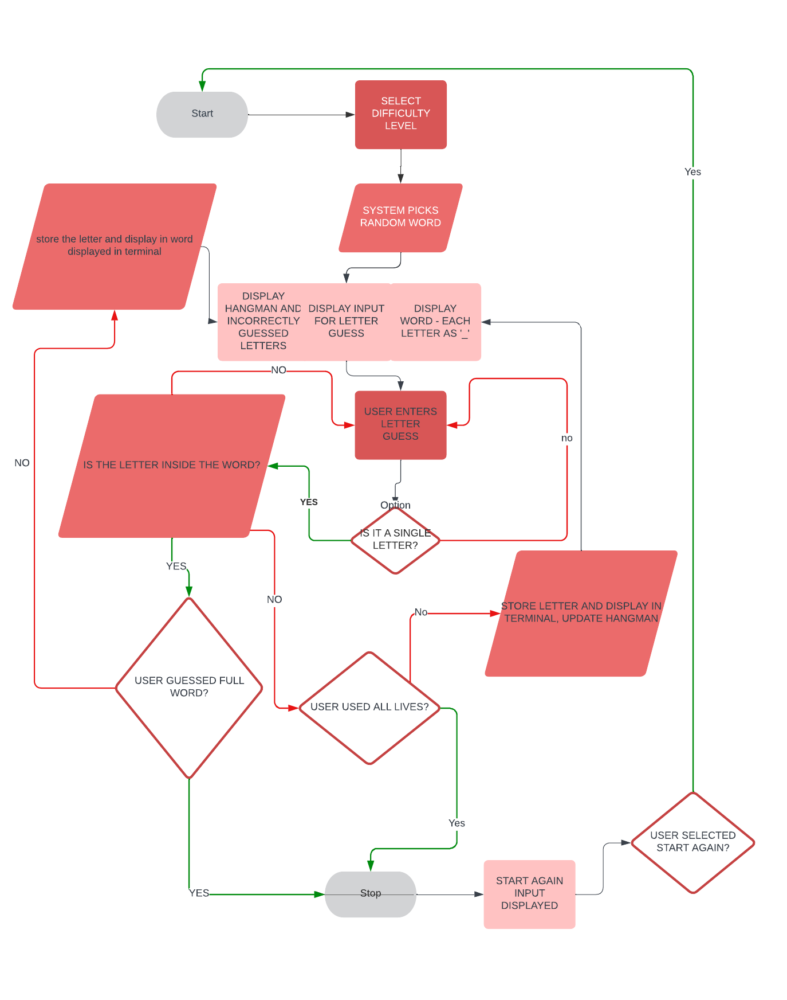

# Hangman
[**click here to see live page**](https://word-hangman.herokuapp.com)
 
Hangman is a game with the aim of guessing blanked out word. User gets 7 lives which matches the number of 'body parts' of the hangman. Every time user guesses a letter incorrectly, another body part of the hangman will show. The aim of the game is to guess the word before 7 lives get used and the mans whole body frame shows. The game is aimed at anyone who speaks english, or wants to improve their language skills.

## FEATURES
### MAIN PAGE
* Welcome message and game name shown with an instruction to select difficulty level and an input to do so. Once user inputs one of the options, they will get taken to the game matching level selected. Begginers level is made up of words up to 7 letters, advanced level of words 8 letters and more.

### GAME PAGE

The game page features:
#### INSTRUCTIONAL MESSAGE TO USER 
* This area will show a message each time after user selects a letter. Message will let the user know if they selected a letter that exists inside the word and if they have already selected a letter before in case of any repetitions. 
The aim of this feature is to let user know why the letters don't or do update within the game.

#### HANGMAN DISPLAY
* This feature will start of with no hangman shown. As user inputs letters, this will update with one body part every time guessed letter doesn't exist inside the word.
* The full body frame consists of 7 body parts which matches the number of lifes in the game to logically connect the progress and the displayed feature.
* The aim of this feature is to graphically show the progress to the user.
  

#### WORD DISPLAY
* This feature will start of with every letter being replaced with underscore '_', each underscore will be replaced with a letter is user guesses it correctly.
 The aim of this feature is to allow the user to play the game and guess the word before fully uncovered.

#### INCORRECT LETTERS LIST
* This feature will store any incorrectly guessed letters by the user.
* The aim of this is for the user to not have to remember the already used incorrect guesses  and as game progresses possibly to guess the word easier

#### REMAINING LIVES COUNT
* This feature starts of with 7 lives and goes down by 1 every time a letter which doesn't exist inside the word gets used. 
* The aim of this is to show how many tries the user has left before they loose.

#### GUESS THE LETTER INPUT
* This is the feature where user inputs their guesses. The input will only accept single letters, no numbers or special characters. An error will show if unwanted input gets used.

### GAME OVER PAGE
* This will show when user uses all their chances.

The game over page features:
#### WORD DISPLAYED
* This feature will show the word which the user didn't guess
  The aim of this is to update the user with what they played against.

#### GAME OVER HANGMAN DISPLAY
* This will show the fully build hanging hangman
* The aim of this is to picture the game loss.

#### START AGAIN
* An input available to the user. If they press 1, the program will start from the beggining, taking them to welcome page and allowing the program to select new word for fresh round.
  User will see an error if anything other than number 1 gets used.
* The aim of this is to allow the user to easily get back to beggining if they want to play again

### YOU WON PAGE
* This will show when user uses guesses all letters inside the word

The you won page features:
#### WORD DISPLAYED
* This feature will show the guessed word.
  The aim of this is to confirm the word which user guessed.

#### YOU WON HANGMAN DISPLAY
* This will show the fully build hangman, this time not hanging but free of the pole.
  The aim of this is to picture the victory

#### START AGAIN
* An input available to the user. If they press 1, the program will start from the beggining, taking them to welcome page and allowing the program to select new word for fresh round.
  User will see an error if anything other than number 1 gets used.
  The aim of this is to allow the user to easily get back to beggining if they want to play again

## DATA MODEL
### FLOWCHARTS
I have used https://www.lucidchart.com/pages/ to create a flow chart and help me with creating and coding the logic of the app.

### IMPORTS
* I have used Python and external packages which have been imported:
  * os: used to clear the terminal with clear() function
  * random: used to randomly select questions from word list
  * Figlet: used for additional font for welcome and game over page
  * get_english_words_set: list of words needed for the game
  ## TESTING

** ** **  Please note this game will not work on mobiles as it runs on the mock terminal. (cred. Mock terminal created by Code Institute). No accessibilty or responsivity testing was therefore needed. ** ** **

* Python code tested and no significant errors shown. Code passed through:

https://pep8ci.herokuapp.com/https://raw.githubusercontent.com/

* Manually tested within the local and mock terminal all inputs in the game to make sure correct errors show to user and game doesn't break when unwanted input get's used
