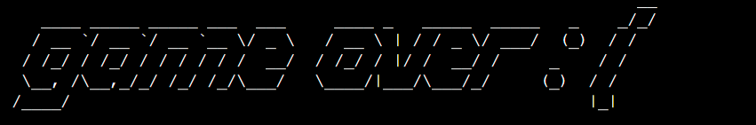

# Hangman
[**click here to see live page**](https://word-hangman.herokuapp.com)

Hangman is a game with the aim of guessing blanked out word. User gets 7 lives which matches the number of 'body parts' of the hangman. Every time user guesses a letter incorrectly, another body part of the hangman will show. The aim of the game is to guess the word before 7 lives get used and the mans whole body frame shows. The game is aimed at anyone who speaks english, or wants to improve their language skills.

## FEATURES
### MAIN PAGE
The main page features:

#### WELCOME MESSAGE
* Welcome message and game name shown, the aim of this is to let user know what the game is as soon as they enter it.

#### INSTRUCTIONS CHOICE INPUT
* An option to press 'y' to view instructions before starting, or 'n' if user doesn't need to see them. The aim of this is to give user an option rather than show the instructions every time if not needed, for better UX.

#### INSTRUCTIONS DISPLAYED
* This is simple and short game instructions. Explanation of levels has also been added. The aim of this feature is to help understand the game for anyone who possibly never seen it before.

Note that an option to press ENTER has been given to continue to next step (level option input described below), the aim of selecting 'enter' over a specific button is again for better UX as it's easier.

#### LEVEL SELECTION INPUT
* The aim of this is to give user a choice of easier or more demanding game. This feature will show either after user chooses not to see instructions( previous feature) or right after instructions have been shown.

### GAME PAGE
The game page features:

#### MESSAGE TO USER
* Message regarding last letter choice. A message advising the user if last letter choice was correct/ incorrect/ already selected. These will show in different colors either green for positive or red for negative. The aim of this is to help the user understand their progression and for the game to feel more dynamic, interactive and user friendly.

#### HANGMAN DISPLAY
* This feature will start of with no hangman shown. As user inputs letters, this will update with one body part every time guessed letter doesn't exist inside the word (This case would also be suported by red message displayed above the hangman as per previous feature above.)

The full body frame consists of 7 body parts which matches the number of lives in the game to logically connect the progress of the game and the displayed feature.

The aim of this feature is to graphically show the progress to the user, make game more interesting and interactive.
  

#### WORD DISPLAY
* This feature will start of with every letter being replaced with underscore '_', each underscore will be replaced with a letter if user guesses it correctly.
 
 The aim of this feature is to allow the user to play the game and guess the word before fully uncovered as the correctly guessed letters in correct places will progressively make the game easier.

#### INCORRECTLY GUESSED LETTERS LIST

* This feature will store any incorrectly guessed letters by the user.
The aim of this is for the user to not have to remember the already used incorrect guesses  and as game progresses possibly to guess the word easier

#### REMAINING LIVES COUNT
* This feature starts of with 7 lives and goes down by 1 every time a letter which doesn't exist inside the word gets used. 
The aim of this is to show how many tries the user has left before they loose, and to logically connect this to the displayed hangman making the game more interesting.

#### ENTER THE LETTER GUESS INPUT
* This is the feature where user inputs their guesses. The input will only accept single letters, no numbers or special characters. An error will show if unwanted input gets used. The aim of this feature is to allow user to play the game.

### GAME OVER PAGE
This will show when user uses all their lives.

The game over page features:

#### GAME OVER HEADING
* The aim of this is to make it clear to the user what happened.

#### WORD IN LOST GAME
* The displayed game word which user didn't guess.

The aim of this is to update the user with what they played against, also user can see if they were close to guessing it.

#### GAME OVER HANGMAN DISPLAY
* This will show the fully build hanging hangman

 The aim of this is to picture the game loss visually.

#### START AGAIN INPUT
* An input available to the user. If they press 1, the program will start from the beggining, taking them to welcome page and allowing the program to select new word for fresh round.
User will see an error if anything other than number 1 gets used.

The aim of this is to allow the user to easily get back to beggining if they want to play again rather than refreshing the page.

### YOU WON PAGE
This will show when user uses guesses all letters inside the word

The you won page features:

#### CELEBRATORY HEADING
* Celebratory heading. 

The aim of this is to make it clear what happend in the game and to connect to the celebratory feeling. 

#### WINNING WORD DISPLAY
* This feature will show the guessed word.
  
  The aim of this is to confirm the word which user guessed. Also better UX

#### WINNER HANGMAN DISPLAY
* This will show the fully build hangman, this time not hanging but free.
  
  The aim of this is to picture the victory to the user.

#### START AGAIN INPUT
* An input available to the user. If they press 1, the program will start from the beggining, taking them to welcome page and allowing the program to select new word for fresh round.
User will see an error if anything other than number 1 gets used.

The aim of this is to allow the user to easily get back to beggining if they want to play again rather than refreshing the page.

### FUTURE FEATURES
* Add different word lists for users to be able to choose a theme they would like to play.( Animals, music geography etc)
* Add an option where user can select if they want some of the letters to be shown in the world from the beggining to make the guessing even easier.

## DATA MODEL

### FLOWCHARTS
I have used [**LUCIDCHART**](https://www.lucidchart.com) to create a flow chart and help me with creating and coding the logic of the app.

### IMPORTS
* I have imported and used Python packages and external packages:
  * `os` : used to clear the terminal with clear() function
  * `random`: used to randomly select questions from word list
  * `Figlet`: used for additional font for welcome and game over page
  * `get_english_words_set`: list of words needed for the game
  * `colorama` - used to apply color to the game in terminal

## TESTING

** ** **  Please note this game will not work on mobiles as it runs on the mock terminal. (cred. Mock terminal created by Code Institute). No accessibilty or responsivity testing was therefore needed. ** ** **

### VALIDATOR TESTING 
* Python code tested and no significant errors shown. Code passed through:

[**CI PYTHON LINTER**](https://pep8ci.herokuapp.com/https://raw.githubusercontent.com/)

  validated run.py file: 

validated hangman.py file:

### FUNCTIONAL TESTING
|   INPUT                                        |            action                    |   expected                                                       |   actual                    |
|------------------------------------------------|--------------------------------------|------------------------------------------------------------------|-----------------------------|
| Do you want to see istructions? y/n:           |-user enters 'y'                      | -instructions display                                            |                             |
|                                                |                                      | -an input to press ENTER to continue displays                    | as expected                 |
|                                                |                                      |                                                                  |                             |
|                                                |-user enters 'n'                      | -display input to select level                                   | as expected                 |
|                                                |                                      |                                                                  |                             |
|                                                |-user clicks any other button         |-a message error and try again                                    | as expected                 |
|                                                |                                      |                                                                  |                             |
| Press enter to proceed                         |-user pressed 'enter'                 |-display input to select level                                    | as expected                 |
|                                                |                                      |                                                                  |                             |
|                                                |- user clicks any other option        |- nothing happens unless user follows with 'enter'                | as expected                 |
|                                                |(incl.numbers and special char)       |  no need to clear if user inputs other buttons                   |                             |
|                                                |                                      |  as long as enter is entered                                     |                             |
|                                                |                                      |                                                                  |                             |
| Enter 1 for beginners or 2 for advanced level: |- user enters 1                       |- game starts with words of lenght 7                              | as expected                 |
|                                                |                                      |                                                                  |                             |
|                                                |- user enters 2                       |- game starts  with words of lenght > 7                           | as expected                 |               
|                                                |                                      |                                                                  |                             |
|                                                |- user enters any other option        |- display appropriate error, show input again                     | as expected                 |
|                                                |(incl.numbers and special char)       |                                                                  |                             |
|                                                |                                      |                                                                  |                             |
| Enter the letter here:                         |- user enters single letter           |- letter verified in the game, appropriate message displayed      | as expected                 |
|                                                |                                      | to communicate to user if guess was correct or not.              |                             |
|                                                |                                      | If guess was incorrect: add to incorrect list displayed,         |                             |
|                                                |                                      | Hangman updated, remaining lives -1.                             |                             |
|                                                |                                      | If guess was correct: Update letter in word displayed.           |                             |
|                                                |                                      | Game continues, input cleared and ready for another try          |                             |
|                                                |                                      |                                                                  |                             |
|                                                | -user enters multiple letters        | -message error displayed                                         | as expected                 |
|                                                | or any other character               | input printed again to input letter                              |                             |
|                                                |                                      |                                                                  |                             |
| Press 1, if you want to start again:           | - user enters 1                      | - game starts again from welcome page                            | as expected                 |
|                                                |                                      |                                                                  |                             |
|                                                |- user enters any other option        | - message error displayed and input printed again                | as expected                 |
|                                                | (incl. numbers and special char)     |                                                                  |                             |
|                                                |                                      |                                                                  |                             |
|                                                |                                      |                                                                  |                             |
APPLICATION DIDN'T BREAK NO MATTER WHAT WAS ENTERED INTO THE INPUTS AND APPROPRIATE ERRORS SHOW.

## TOOLS AND TECHNOLOGIES
* Python - back end programming
* Github - used to store code online
* Git - version control:

    Code has been pushed with git commands to remote repository on Github with commands:
   * git add . - to add files ready to commit
   * git commit -m "message" - to commit the code to local 
    repository ready to be pushed
  * git push - final command used to push commited code to remote repo on Github
* Heroku - to deploy the app 
* [**Screen Record**](https://chrome.google.com/webstore/detail/screen-recorder/hniebljpgcogalllopnjokppmgbhaden) extension to create video of the game for README file
* [**Ezgif**](https://ezgif.com/video-to-gif) - to convert video into gif for README file
   

## DEPLOYMENT
The app has been displayed thanks to template provided by Code Institue to allow others to test the code.

The project has been deployed on Heroku as follows:

## CLONING THE REPOSITORY

1. On Github navigate to repository
2. Click "Code" a green button shown right above the file list
3. Copy the URL of the repo using HTTPS, SSH OR Github CLI
4. Open Git Bash
5. Change the current working directory to the location where you want the cloned directory
6. Type git clone, and then paste the URL you copied earlier
7. Press enter to create local Clone

For more details on how to clone the remote repo in order to create a local copy for own use, please go to 
https://docs.github.com/en/repositories/creating-and-managing-repositories/cloning-a-repository

## FORKING
1. On Github navigate to repository
2. click "Fork" located towards the top right corner
3. Select "owner" for the forked repo, from the dropdown menu under "owner" Under "Owner"
4. It will create forked repo under the same name as orinial by default but you can type a name in "Repository name" or add a description in "Description" box.
5. Click "Create fork" !

Forking allows you to make any changes without affecting original project. You can send the suggestions over by submitting pull request. Project owner can review the pull request before accepting the suggestions and merging them.

For more details on how to fork the repo, in order to for example suggest any changes to the project you can visit: 
https://docs.github.com/en/get-started/quickstart/fork-a-repo

When you have fork to a repository you don't have access to files locally on your device, for this you will need to clone the forked repo.

## CREDITS
* [**Code Institute for template provided**](https://github.com/Code-Institute-Org/p3-template)
* Both links used to code the game :
   * [**HANGMAN FEATURE AND BODY OF THE GAME**](https://www.askpython.com/python/examples/hangman-game-in-python)
   * [**BODY OF THE GAME**](https://codefather.tech/blog/hangman-game-python/?utm_content=cmp-true)
* Used to convert video of the game to a gif for README file - [**EZGIF**](https://ezgif.com/video-to-gif)
* Used to create the video of the game needed to create gif for README - [**SCREEN RECORDER**](https://chrome.google.com/webstore/detail/screen-recorder/hniebljpgcogalllopnjokppmgbhaden)
* Used for help with README file - [**MAD- KING, JOHNATHAN'S PROJECT**](https://github.com/Jonathan97-web/Mad-King/blob/main/README.md#tools--technologies-used) 

